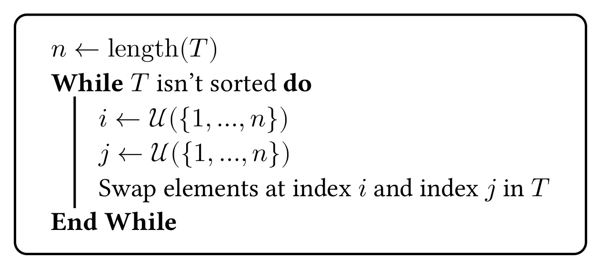
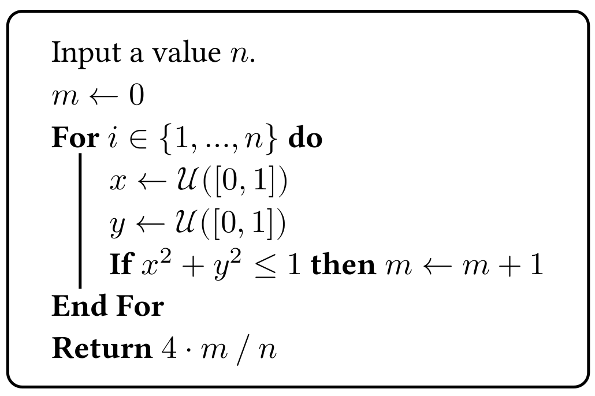
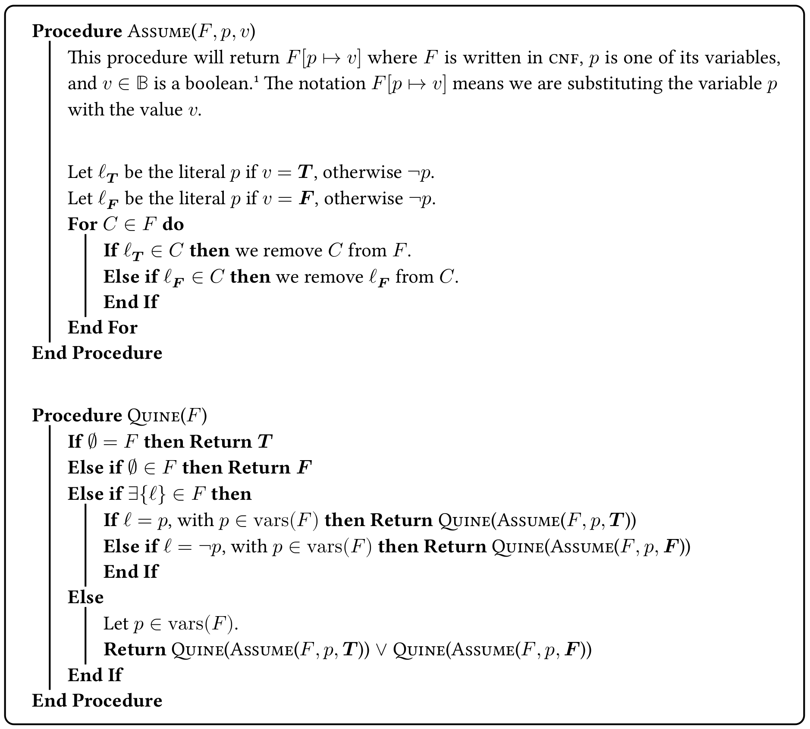

# The `typst-algo` package.

This package helps you typeset algorithms in Typst.

To learn more about this package, take a look at the [manual](docs/manual.pdf).

## Examples of algorithms (extracted from the manual)

This is Bogosort, a _very efficent_ sorting algorithm.

This is a Monte-Carlo algorithm to approximate $\pi$.

This is the Quine–McCluskey algorithm for solving SAT.

## Contributing

This project is open-source (MIT-licensed). Feel free to contribute if you think a feature is missing, the code could be improved, or anything else.

Also, feel free to correct any typo you find.
